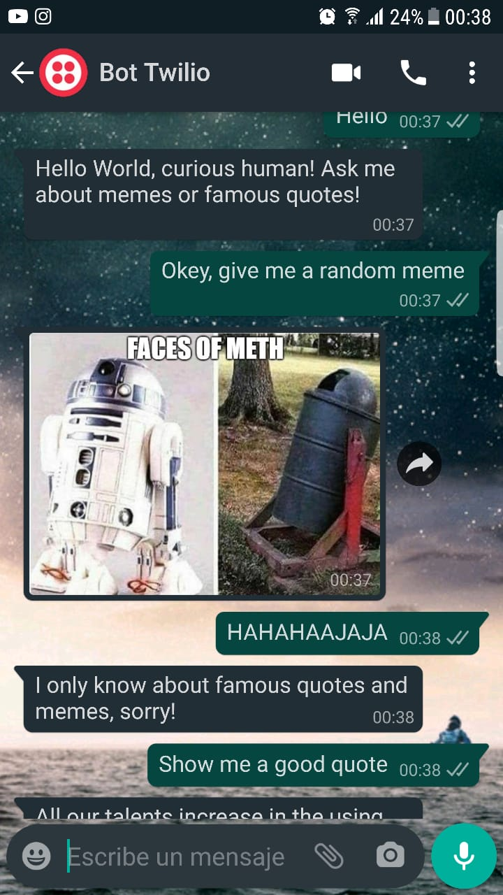

# NickBot
Bot for Random _memes_ and _famous quotes_ development, also a Flask testing project

## Get Started
Python3 and PIP (Package Installer for Python) needed, if u don't know hot to install Python and PIP, see: [Python3 Documentation](https://docs.python.org/3/).

For starting a new virtual environment (in *Visual Studio Code* or another text editor or IDE), use `py -m venv env`, where "env" is the (customizable) name of de environment.

Inside of the project folder, install all the project's dependencies with `pip install -r requirements.txt`.

## Development server inside Text Editor or IDE
Just execute the code. Example: In *Visual Studio Code* you need to press `Ctrl+F5` for a dev server; then navigate to `http://localhost:5000/`. The app WON'T automatically reload if you change any of the source files, except static rendered files like `site.css`.

## Development server outside Text Editor or IDE
Use the following steps from a terminal:

1 - Set an environment variable for FLASK_APP. On *Linux* and *macOS*, use `export set FLASK_APP=webapp;` on *Windows* use set `FLASK_APP=webapp`.

2 - Navigate into the simple_app folder (`cd ...`), then launch the program using `python3 -m flask run` (*Linux/macOS*) or `python -m flask run` (*Windows*). The commands `python` and `py` are equivalent.

## Updating Requirements with new dependencies
For updating the requirements.txt file, use `pip freeze > requirements.txt`.

## Twilio Console
For Bot Development: A *Twilio* account is required (there are free plans). Then, you need to activate your [WhatsApp Sandbox](https://www.twilio.com/console/sms/whatsapp/sandbox) or ask for a programmable phone number with SMS capability. You can also do both.

## Ngrok Console
The installation of *Ngrok* is necessary (in development, not anymore in production) in order to forward HTTP request traffic from a temporary public URI to your local server (LocalHost):

1 - Download *Ngrok* from [here](https://ngrok.com/download).

2 - Extract the Zip file and open *ngrok.exe*.

3 - _(optional)_ Make an *Ngrok* account in their website, and copy your _authtoken_. Then, paste in the *ngrok.exe* console: `ngrok authtoken [yourToken]` (This will grant you access to more features and longer session times).

4 - Knowing the port were your development server is running (default is 5000, can be another), write: `ngrok http 5000`.

5 - Copy the URI generated by *Ngrok* in the *Twilio* console configurations for SMS or WhatsApp. Free accounts have an 8 hours expiration of every new public URI.

## Bot Usage
Trough WhatsApp or SMS ask the Bot something about memes or famous quotes.

>Note: I don't have a public programable number yet, if u don't want to create step by step your own accounts and a development free number, ask me for a development one.

## Further help
For any questions or offer suggestions, send me an email at [niconelli2@gmail.com](mailto:niconelli2@gmail.com).

## Chatting Example

